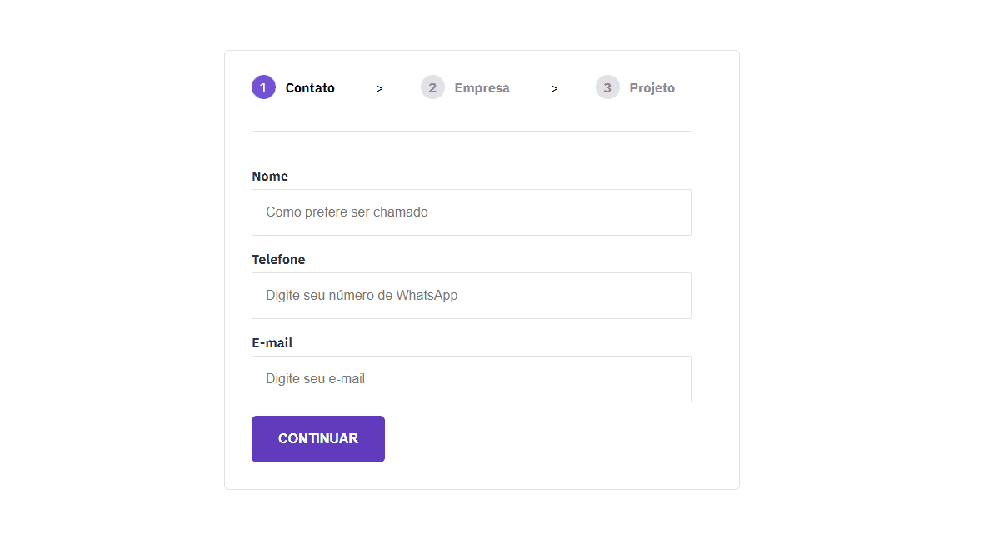
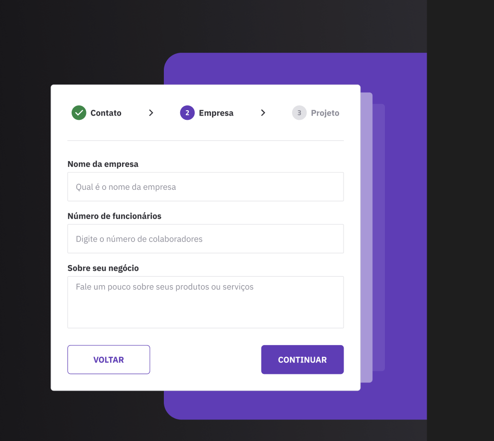

<h1 align="center"> #23 Formulário Multi Step </h1>

É o #23 desafio <a href="https://boracodar.dev/">#BORACODAR</a> da RocketSeat 

  <a href="#-tecnologias">Tecnologias</a>&nbsp;&nbsp;&nbsp;|&nbsp;&nbsp;&nbsp;
  <a href="#-projeto">Projeto</a>&nbsp;&nbsp;&nbsp;|&nbsp;&nbsp;&nbsp;
  <a href="#-layout">Layout</a>&nbsp;&nbsp;&nbsp;|&nbsp;&nbsp;&nbsp;
  <a href="#-collaborators">Collaborators</a>&nbsp;&nbsp;&nbsp;|&nbsp;&nbsp;&nbsp;

 

  

## 🚀 Tecnologias

Esse projeto foi desenvolvido com as seguintes tecnologias:

- HTML
- CSS
- JavaScript
- React
- Git e Github
- Figma
- Next

## 💻 Projeto

O projeto _Multi Step Form_ foi realizado como parte do #23 desafio #BORACODAR da RocketSeat sugerido pelo professor <a href="https://github.com/maykbrito" alt="Link para o GitHub do professor Mayk Brito" target="_blank">Mayk Brito</a>.

<h1 align="center">
  Funcionalidades
</h1>

O desafio foi a criação de um Multi Step Form, o layout proposto está disponível em <a href="#-layout-figma">Layout</a>.

_<h2 align="center" ><a href="https://multi-step-form-gilt-nine.vercel.app/" target="_blank">Visite o projeto online</a></h2>_

## 🔖 Layout

Você pode visualizar o layout proposto pela RocketSeat através do da <a href="#-layout-figma">imagem abaixo</a>. Disponibilizado pelo [Figma](https://figma.com) durante o período do desafio.

  

## 📃 Collaborators

This challange was made by [Julia](https://gsajulia.github.io) and [Ricardo](https://rickazuo.github.io/portfolio/)
